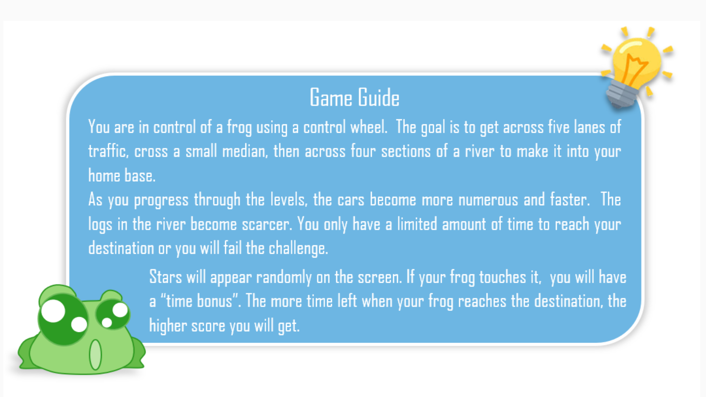
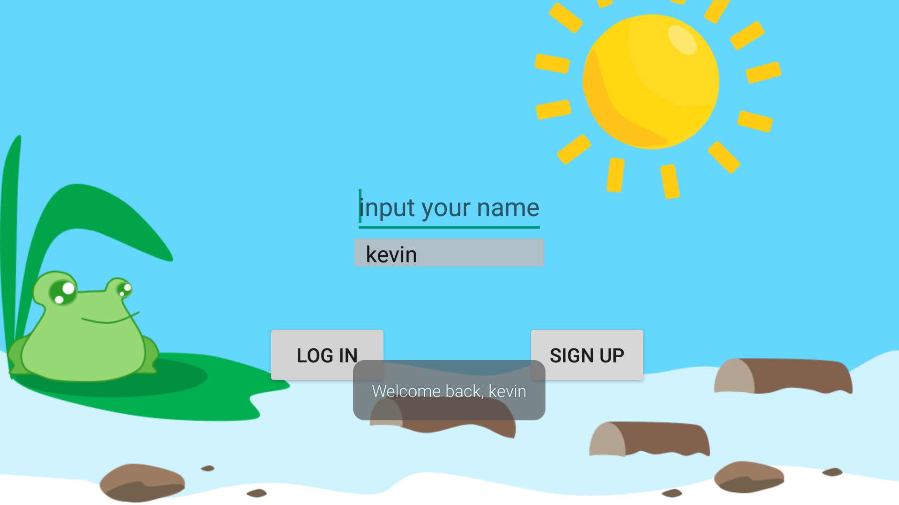
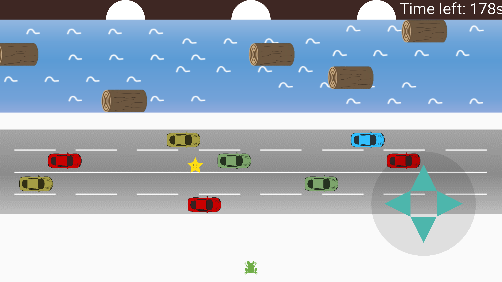
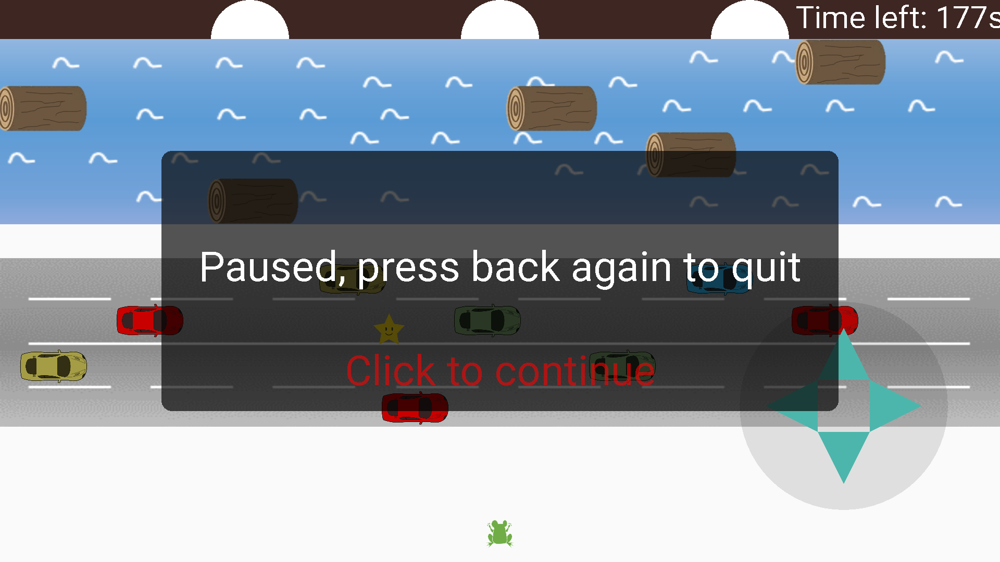
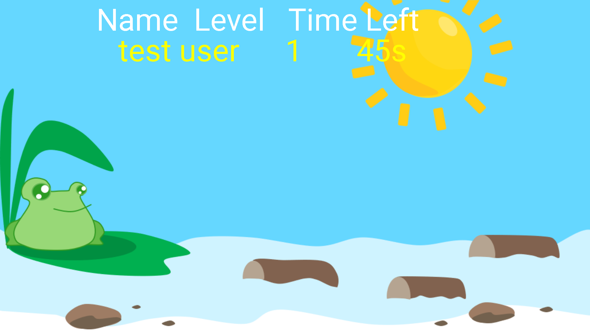

# Frogger
Retro Game for Andriod
You are in control of a frog using a control wheel. The goal is to get across five lanes of traffic, cross a small median, then across four sections of a river to make it into your home base. As you progress through the levels, the cars become more numerous and faster. The logs in the river become scarcer. You only have a limited amount of time to reach your destination or you will fail the challenge. Stars will appear randomly on the screen. If your frog touches it, you will have a “time bonus”. The more time left when your frog reaches the destination, the higher score you will get

## Screen shots

